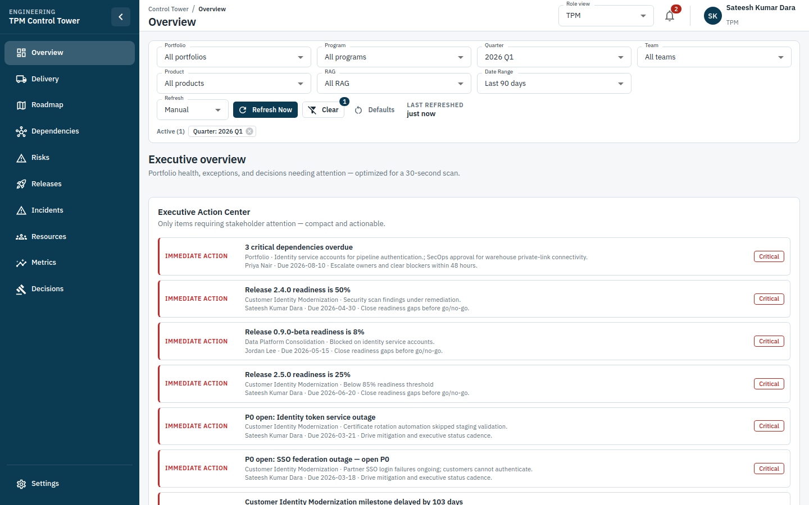

# TPM Control Tower

Enterprise Technical Program Management dashboard for TPMs, Engineering Managers, Product Managers, and executive stakeholders.



> **Check-in convention:** Every GitHub commit that changes the UI must refresh `docs/screenshots/latest-ui.png` and keep this README image current.

## Stack

- React 19 + TypeScript
- Vite
- Material UI (MUI)
- React Router
- TanStack Query
- Recharts
- ESLint + Prettier

## Getting started

```bash
npm install
npm run dev
```

Open [http://localhost:5173](http://localhost:5173).

### Local Windows setup (`C:\TPM`)

```powershell
New-Item -ItemType Directory -Force -Path C:\TPM | Out-Null
cd C:\TPM
git clone https://github.com/sateeshdarajob/Apps.git
cd Apps
git checkout cursor/tpm-app-shell-0779
npm install
npm run dev
```

## Scripts

| Command | Description |
| --- | --- |
| `npm run dev` | Start Vite development server |
| `npm run build` | Typecheck and production build |
| `npm run preview` | Preview production build |
| `npm run lint` | Run ESLint |
| `npm run format` | Format with Prettier |
| `npm run typecheck` | TypeScript project references check |

## Architecture

```
src/
  app/           # App root, providers, router, shared FilterProvider
  components/    # Layout shell + reusable UI primitives
  data/mock/     # Centralized mock domain + filter option data
  hooks/         # Global filters + TanStack Query hooks
  pages/         # Route-level screens (placeholders for now)
  services/      # Async data access (mock today, API-ready later)
  theme/         # MUI theme
  types/         # Shared TypeScript domain types
  utils/         # Formatting and RAG helpers
```

Global filters and refresh controls live in `FilterProvider` and are consumed via `useGlobalFilters()` so every page shares the same application state.

## Application shell

- Collapsible left navigation (responsive temporary drawer on mobile)
- Top header with breadcrumbs, notifications, and user profile
- Global filter bar: Portfolio, Program, Quarter, Team, Product, RAG Status, Date Range
- Refresh Now + auto-refresh (Manual / 5 / 15 / 30 / 60 min) + last refreshed timestamp
- Routed placeholder pages for Overview, Delivery, Roadmap, Dependencies, Risks, Releases, Incidents, Resources, Metrics, Decisions, Settings

Detailed charts and dashboard widgets are intentionally deferred to the next increment.
